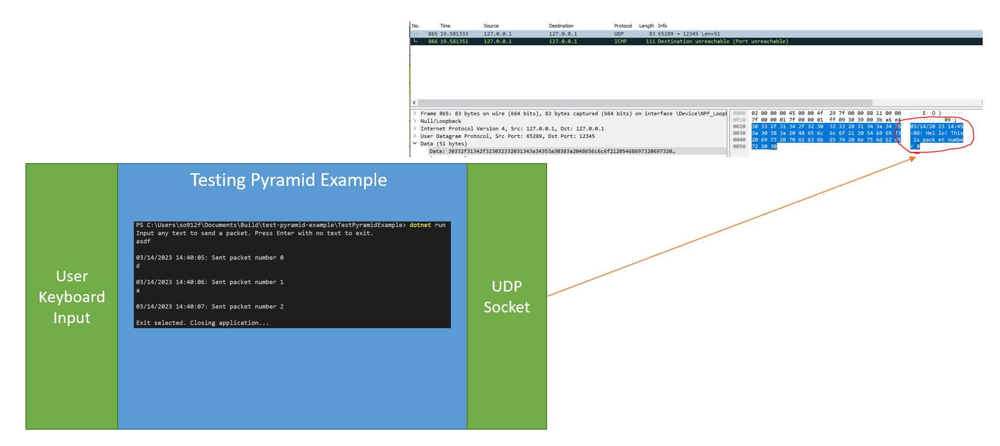

# Description
This application sends a UDP packet whenever a string is input and exits if Enter pressed without a string. The project has 3 test projects: Unit/Integration/E2E to demonstrate the layers of the test pyramid on it as well as one project named BDD to demonstrate Behavior Driven Development

You can run this application just from the console given you've downloaded the [.NET SDK 7.0](https://dotnet.microsoft.com/en-us/download/dotnet/7.0) following the usage section of this README or you can run it with [Visual Studio 2022](https://visualstudio.microsoft.com/vs/) which will download the SDK for you.


# Contents
1. `TestPyramidExample` - an application that sends a UDP packet whenever a string is input, exits if Enter pressed without a string
2. `UnitTests` - An Unit Test project to test individual classes in TestPyramidExample such as TimestampProvider which is responsible for getting a timestamp in a certain format
3. `IntegrationTests` - An Integration Test project that uses Fake implementations of TestPyramidExample's dependencies to test 3 console inputs sending 3 udp packets and to test an empty string causing the app to shutdown
4. `E2ETests` - An end-to-end test that runs the TestPyramidExample application in a subprocess, feeds it inputs from standardinput, and receives packets from TestPyramidExample to assert they were received after a certain amount of time
5. `BDD` - A Behavior Driven Develompent project that basically does the same thing as the `IntegrationTests` project but via a BDD framework called `Specflow` for C#

# Usage 
### Running TestPyramidExample
```console
    $ cd TestPyramidExample
    $ dotnet run
```
### Running all tests
```console
    $ dotnet test
```

### Running BDD tests
```console
    $ cd BDD
    $ dotnet test
```

# References
- [The Test Pyramid](https://medium.com/creditas-tech/the-test-pyramid-ac7bf8bb418e)
